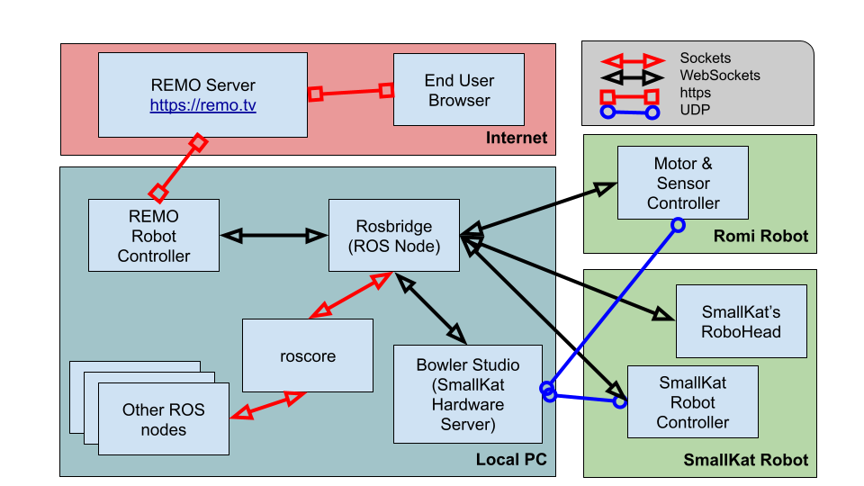

# rosbridge.py
The rosbridge 'hardware' integration to remo.tv is intended to be a 
generic interface between [https://remo.tv](https://remo.tv) and ROS.

It publishes the JSON command received from remo.tv to rosbridge as a JSON string

## Architecture: remo <-> ROS <-> Bowler Studio <-> SmallKat
The rosbridge interface code **does NOT** require Bowler Studio nor SmallKat.
They are included here as an example of what can be done.


## Installs
- [Install remo.tv controller](https://github.com/javatechs/controller) software.
- [Install rosbridge_server](http://wiki.ros.org/rosbridge_suite?distro=kinetic) ROS package.
- [Install roslibpy](https://github.com/gramaziokohler/roslibpy) library.
- Optional. [Install Bowler & SmallKat extensions.](https://github.com/javatechs/BowlerDebug/blob/master/src/main/groovy/LoadGameController2.md)

## Configure controller.conf
- **type** or 'hardware' type should be rosbridge.

```
       type=rosbridge
```

- **host** is the machine with the rosbridge node.
- **port** is the machine with the rosbridge node.
- **user_slice** is the machine with the rosbridge node.
- **uid** camera user id.
- **pwd** camera password.

```
		##
		# ROSbridge settings
		##
		[rosbridge]
		host = 10.0.0.1
		port = 9090
		user_slice = 60.0
		uid=xx
		pwd=xx
```

## Try rosbridge & remo
- Start [remo.tv](https://github.com/javatechs/controller) controller

```
$ ~/remotv$ python controller.py
```
- Start [rosbridge server](http://wiki.ros.org/rosbridge_suite?distro=kinetic)

```
$ roslaunch rosbridge_server rosbridge_websocket.launch 
```
The launch script starts roscore and rosbridge server ROS node.
Make sure the port used in **controller.conf** matches the one in the log. See below.

```
Rosbridge WebSocket server started at ws://0.0.0.0:9090 
```
- Use rostopic to discover the nodes created.

```
$ rostopic list
/client_count
/connected_clients
/remo_cmd_str
/remo_settings
/rosout
/rosout_agg
$ 
```
- **/remo_cmd_str** is the remo command topic.
- **/remo_settings** are the remo settings from **controller.conf**.
  Topic data is published and latched by rosbridge.setup().
- **/client_count** rosbridge client count.
- **/connected_clients** rosbridge client list.

## JSON Button Definitions
remo.tv uses JSON to store its web interface button definitions.
These buttons are particular to the robot or other device to be controlled.

JSON file | Robot
--------- | -----
[small_kat.json](small_kat.json) | [SmallKat](https://hackaday.io/project/164727-smallkat-an-adorable-dynamics-oriented-robot-cat)

## Reference Links
* [Rosbridge Suite](http://wiki.ros.org/rosbridge_suite)
* [roslibpy repository](https://github.com/gramaziokohler/roslibpy)
* [roslibpy documentation](https://roslibpy.readthedocs.io/en/latest/reference/index.html)
